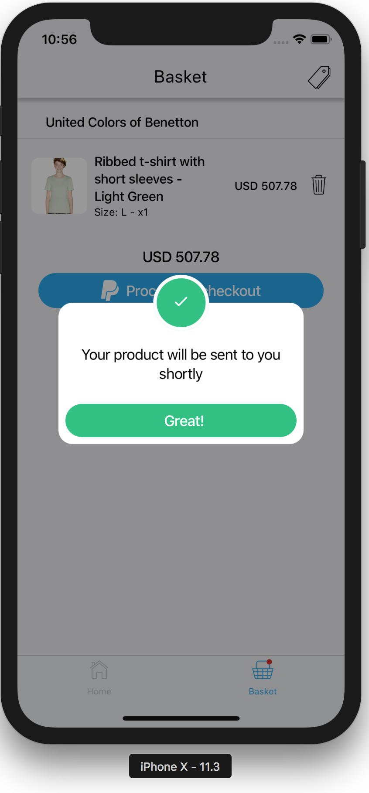

# React Native Fancy Alerts

### Inspired on [nativescript-fancyalert](https://github.com/NathanWalker/nativescript-fancyalert) - A simple, basic implementation of the beautiful alerts that lib brings to the table

### Intro

I used to be a Nativescript developer. One of the last libraries that I started using was [nativescript-fancyalert](https://github.com/NathanWalker/nativescript-fancyalert) and I really loved the extra touch of style it added to my interfaces.
As soon as I ran into the need for simple dialogs in my newest app which I'm developing with React Native I decided to go ahead and make something that looked like fancy alerts. For now, this is a very basic, simple implementation with only the features I need right now and, unfortunately, still has layour issues when ran on Android. The idea is to make this a more general purpose library and make it compatible with Android and iOS seamlessly so that releasing it as a module on NPM actually makes sense.

### The result will be something like this...

|  |  |  |
| ---------------------------------------------- | ---------------------------------------------- | ------------------------------------------ |


### Quick Start

```javascript
import React, { Component } from "react";
import { View } from "react-native";
import { FancyAlert, LoadingIndicator } from "react-native-expo-fancy-alerts";

export default class MyComponent extends Component {
  state = {
    isLoading: false,
    errorMessage: {
      visible: false,
      message: ""
    }
  };

  startLoading = () => {
    if (!this.state.isLoading) {
      this.setState({ isLoading: true });
    }
  };

  finishLoading = () => {
    if (this.state.isLoading) {
      this.setState({ isLoading: false });
    }
  };

  showErrorAlert = message => {
    if (!this.state.errorAlert.visible) {
      this.setState({ errorAlert: { visible: true, message } });
    }
  };

  hideErrorAlert = () => {
    if (this.state.errorAlert.visible) {
      this.setState({ errorAlert: { visible: false, message: "" } });
    }
  };

  simulateLoading = () => {
    this.startLoading();

    setTimeout(() => {
      this.finishLoading();
    }, 300);
  };

  fakeError = () => {
    this.showErrorAlert("I failed... :(");
  };

  render = () => {
    const { isLoading, errorMessage } = this.state;

    return (
      <View>
        <TouchableOpacity onPress={this.simulateLoading}>
          <Text>Load now!!</Text>
        </TouchableOpacity>

        <TouchableOpacity onPress={this.fakeError}>
          <Text>Make me think I falied :(</Text>
        </TouchableOpacity>

        <Loading visible={isLoading} />

        <FancyAlert
          visible={errorAlert.visible}
          icon={
            <Ionicons
              name={Platform.OS === "ios" ? "ios-close-outline" : "md-close"}
              size={36}
              color="#FFFFFF"
            />
          }
          color="#C3272B"
          message={errorAlert.message}
          btnText="OK"
          onRequestClose={this.hideErrorAlert}
        />
      </View>
    );
  };
}
```

## Reference

### LoadingIndicator

| Property | Type | Required | Default | Description |
| visible | bool | yes | n/a | Whether the loading indicator should be shown |

### FancyAlert

| Property | Type | Required | Default | Description |
| visible | bool | yes | n/a | Whether the alert should be visible |
| icon | node | yes | n/a | The icon to show in the alert |
| color | string | yes | n/a | The color to use for the button and the icon container |
| message | string | yes | n/a | The message to show the user |
| btnText | string | yes | n/a | The text to put inside the button |
| onRequestClose | func | no | () => null | The action to run when the user taps the button |

* NOTE -
  No dialog is closed by tapping the blurred background.

## Changelog

* 0.0.1 - Initial implementation - has layout issues on Android that WILL be fixed
