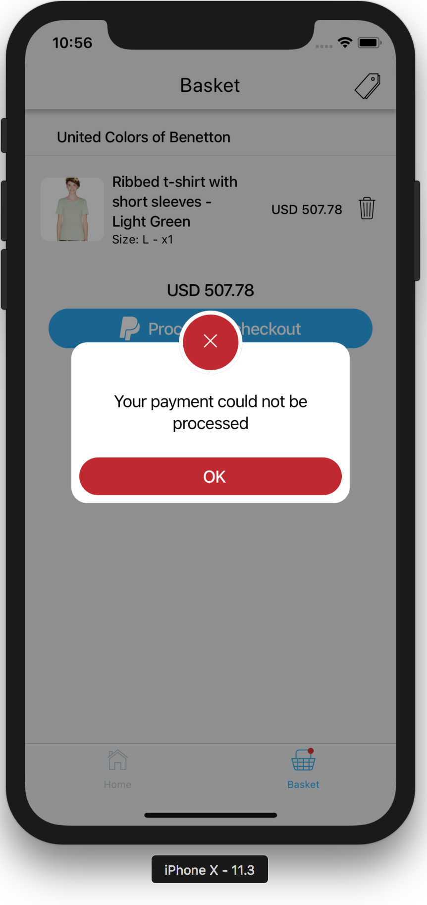

# React Native Fancy Alerts

[![NPM version][npm-image]][npm-url]
[![Downloads][downloads-image]][npm-url]

[npm-image]:http://img.shields.io/npm/v/react-native-expo-fancy-alerts.svg
[npm-url]:https://npmjs.org/package/react-native-expo-fancy-alerts
[downloads-image]:http://img.shields.io/npm/dm/react-native-expo-fancy-alerts.svg

## Inspired on [nativescript-fancyalert](https://github.com/NathanWalker/nativescript-fancyalert) - A simple, basic implementation of the beautiful alerts that lib brings to the table

### Intro

Adaptation of [nativescript-fancyalert](https://github.com/NathanWalker/nativescript-fancyalert) for react native. Compatible with expo 🤓

|  |  |  |
| ---------------------------------------------- | ---------------------------------------------- | ------------------------------------------ |

### Quick Start

```javascript
import React from 'react';
import { Text, TouchableOpacity, View } from 'react-native';
import { FancyAlert } from 'react-native-expo-fancy-alerts';

const App = () => {
  const [visible, setVisible] = React.useState(false);
  const toggleAlert = React.useCallback(() => {
    setVisible(!visible);
  }, [visible]);

  return (
    <View>
      <TouchableOpacity onPress={toggleAlert}>
        <Text>Tap me</Text>
      </TouchableOpacity>

      <FancyAlert
        visible={visible}
        icon={<View style={{
          flex: 1,
          display: 'flex',
          justifyContent: 'center',
          alignItems: 'center',
          backgroundColor: 'red',
          borderRadius: '50%',
          width: '100%',
        }}><Text>🤓</Text></View>}
        style={{ backgroundColor: 'white' }}
      >
        <Text style={{ marginTop: -16, marginBottom: 32 }}>Hello there</Text>
      </FancyAlert>
    </View>
  )
}

export default App;
```

## Reference

### LoadingIndicator

| Property | Type | Required | Default | Description                                   |
| -------- | ---- | -------- | ------- | --------------------------------------------- |
| visible  | bool | yes      | n/a     | Whether the loading indicator should be shown |

### FancyAlert

| Property       | Type   | Required | Default      | Description                                            |
| -------------- | ------ | -------- | ------------ | ------------------------------------------------------ |
| visible        | bool   | yes      | n/a          | Whether the alert should be visible                    |
| icon           | node   | yes      | n/a          | The icon to show in the alert                          |
| style          | object | no       | `{}`         | Like your usual style prop in any View                 |
| onRequestClose | func   | no       | `() => void` | The action to run when the user taps the button        |

* NOTE -
  Alerts are not dismissed by tapping the blurry background

## Changelog

* 0.0.1 - Initial implementation - has layout issues on Android that WILL be fixed
* 0.0.2 - Android issue fixed
* 0.0.3 - Added extra customization options
* 1.0.0 - Years later I decided to package everything and release 🎉🥳
* 2.0.0 - **BREAKING CHANGES** Updated `FancyAlert` to be more intuitive and more generic
